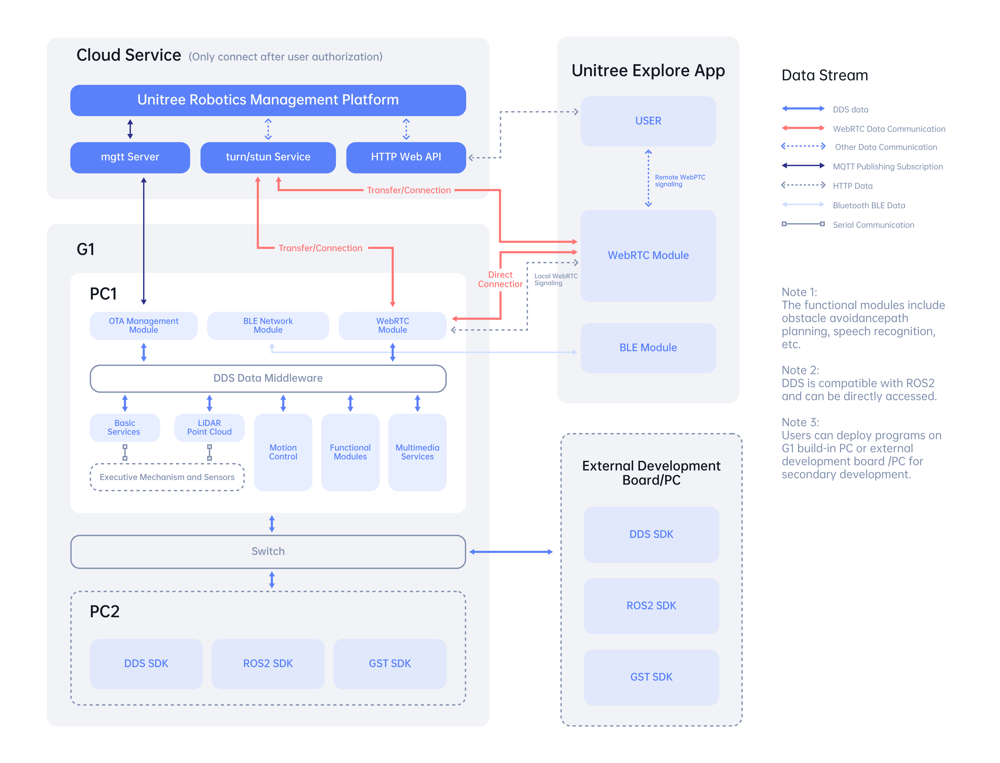

# Unitree G1 EDU Robot

Software stack for the Unitree G1 EDU humanoid, built as a university capstone project in collaboration with **PickMe** (Sri Lanka's ride-hailing platform). The repository spans three layers: low-level RL locomotion control in simulation, 2D/3D mapping and Nav2-based navigation, and a voice-driven RAG conversational agent that lets the G1 act as an airport mobility concierge.

<p align="center">
  
</p>

See [`Robot_Architecture.md`](Robot_Architecture.md) for a full breakdown of how the cloud service, the robot's onboard computers (PC1/PC2), the Unitree Explore app, and external developer tooling communicate over MQTT, HTTP, WebRTC, BLE, and DDS.

## What's in here

| Area | Package | Description |
|---|---|---|
| Locomotion | [`g1_core`](g1-ros2-workspace/src/g1_core) | ONNX-based RL policy state machine and keyboard teleop (`/cmd_vel`) |
| Simulation | [`g1_mujoco`](g1-ros2-workspace/src/g1_mujoco) | MuJoCo bridge node exposing the simulated G1 as ROS2 topics |
| Simulation | `unitree_mujoco`, `unitree_rl_mjlab` | Git submodules — Unitree's simulator and RL training environment |
| Mapping | [`g1_mapping`](g1-ros2-workspace/src/g1_mapping) | Live voxelized 3D mapping and RViz visualization from LiDAR |
| Navigation | [`g1_navigation`](g1-ros2-workspace/src/g1_navigation) | SLAM Toolbox + Nav2 integration, point cloud filtering, command arbitration, and a browser-based control gateway |
| Web UI | [`g1-navigation-ui`](g1-navigation-ui) | React/Vite front end for driving, mapping, and sending navigation goals |
| Conversational AI | [`g1_conversation`](g1-ros2-workspace/src/g1_conversation) | RAG-powered voice concierge that explains and helps install the PickMe app |

Each package with its own operational quirks has a dedicated README — see [`g1_mapping/README.md`](g1-ros2-workspace/src/g1_mapping/README.md) and [`g1_navigation/README.md`](g1-ros2-workspace/src/g1_navigation/README.md) for detailed run instructions.

## PickMe Robotic Mobility Concierge

The flagship application (`g1_conversation`) turns the G1 into a passenger-facing concierge for airport pickups:

```
Mic → WebRTC VAD → Whisper STT → LangChain RAG Agent (Gemini + FAISS) → edge-tts → G1 Speaker
```

- Detects speech with WebRTC VAD, transcribes it locally with Whisper (`faster-whisper` / `openai-whisper`).
- Runs a LangChain agent grounded in a FAISS knowledge base (PickMe services, app installation steps, Sri Lanka location data) embedded via Gemini — answers stay within approved sources.
- Replies with `edge-tts` synthesized speech played through the robot.
- Handles multilingual onboarding (English, French, German, Spanish, Russian, Japanese, Chinese, Korean, Hindi, Sinhala, Tamil) and mid-conversation language switching.
- Clears passenger name and session data as soon as a session ends — no PII persists between passengers.
- Publishes intermediate state (transcriptions, agent responses, session events) as ROS2 topics for monitoring.

Phase 1 scope is informational: the robot explains PickMe and helps a passenger install the app. Ride booking is not yet implemented.

## Prerequisites

- Ubuntu 24.04 with **ROS2 Jazzy**
- Python 3.10+
- Node.js 18+ (for the navigation UI)
- MuJoCo (via the `unitree_mujoco` submodule) for simulation
- A Gemini API key for the conversation agent's embeddings and RAG generation

## Getting started

Clone with submodules:

```bash
git clone --recurse-submodules https://github.com/RafiMAA/Unitree_G1_EDU_Robot.git
cd Unitree_G1_EDU_Robot
```

Build the ROS2 workspace:

```bash
cd g1-ros2-workspace
source /opt/ros/jazzy/setup.bash
colcon build --symlink-install
source install/setup.bash
```

### Run the simulator + locomotion

```bash
ros2 launch g1_mujoco sim.launch.py
```

In another terminal, drive the robot manually:

```bash
ros2 run g1_core teleop_keyboard
```

`W`/`S` walk forward/backward, `A`/`D` turn, `Q`/`E` strafe, `+`/`-` adjust speed, `SPACE` stops, `X` quits.

### Run mapping or navigation

Follow [`g1_mapping/README.md`](g1-ros2-workspace/src/g1_mapping/README.md) for 3D voxel mapping in RViz, or [`g1_navigation/README.md`](g1-ros2-workspace/src/g1_navigation/README.md) for SLAM + Nav2 with the React control UI (`npm install && npm run dev` in `g1-navigation-ui`).

### Run the conversational concierge

```bash
cd g1-ros2-workspace/src/g1_conversation
pip install -r requirements.txt
```

Set your Gemini API key (e.g. in a `.env` file), then:

```bash
ros2 run g1_conversation conversation
```

## Deploying to the physical G1

This repository targets simulation by default. Before running any package against real hardware:

- Replace MuJoCo ground-truth odometry with real LiDAR-inertial odometry or SLAM.
- Verify the `map -> odom -> base_footprint -> pelvis -> mid360_link` TF chain is published by the robot.
- Confirm `/g1/mid360/points` (sensor-data QoS) and `/g1/odom` are available, and that a G1 controller subscribes to `/cmd_vel_safe`.
- Re-tune footprint, obstacle-height bands, stop distances, and LiDAR blind regions — current defaults are conservative starting points, not calibrated safety limits.
- Use a safety operator and physical emergency stop. The navigation stack assumes flat indoor floors and does not handle drop-offs, stairs, slopes, or footstep planning.

## Repository layout

```
.
├── Robot_Architecture.md        # Cloud/robot/app communication architecture
├── images/                      # Architecture diagrams
├── g1-navigation-ui/            # React/Vite web control UI
└── g1-ros2-workspace/
    ├── src/
    │   ├── g1_core/              # RL policy state machine, teleop
    │   ├── g1_mujoco/            # MuJoCo <-> ROS2 bridge
    │   ├── g1_mapping/           # Live 3D voxel mapping
    │   ├── g1_navigation/        # SLAM, Nav2, web gateway
    │   ├── g1_conversation/      # PickMe RAG voice concierge
    │   └── unitree_mujoco/       # Submodule: Unitree's MuJoCo simulator
    └── unitree_rl_mjlab/         # Submodule: Unitree's RL training environment
```

## License

Package-level licenses vary (MIT for `g1_conversation`, Apache-2.0 for `g1_mapping`/`g1_navigation`); see individual `package.xml` files. Add a top-level `LICENSE` file to declare the license for the repository as a whole.

## Acknowledgments

Built on Unitree Robotics' G1 EDU platform and SDKs, ROS2 Jazzy, Nav2, SLAM Toolbox, LangChain, and Google Gemini. Developed as a 5th-semester university capstone project in partnership with PickMe.
