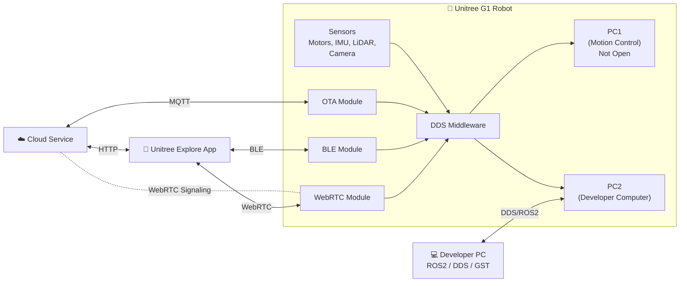

# Unitree G1 Communication Architecture (Simple Explanation)

## Overview

The Unitree G1 robot communicates with four main components:

1. **Cloud Service**
2. **G1 Robot**
3. **Unitree Explore Mobile App**
4. **Developer PC (ROS2/DDS Applications)**

The cloud mainly handles **user accounts, software updates, fault monitoring, and helping establish remote connections**, while the robot and mobile app exchange real-time data using **WebRTC**.

---

# Overall Architecture



---

# Main Components

## ☁️ Cloud Service

The cloud does **three main jobs**.

### 1. Robot Monitoring

The robot sends:

- Battery status
- Error logs
- Software version
- Hardware status

The cloud checks for problems and keeps statistics.

**It does NOT collect private camera data.**

---

### 2. Remote Access

When you control the robot from another location:

```
Phone
   │
Internet
   │
Cloud
   │
Robot
```

The cloud helps establish the connection.

After that, the robot and phone communicate directly using **WebRTC** whenever possible.

If a direct connection cannot be established, the TURN server forwards the data.

---

### 3. OTA Updates

OTA (Over-The-Air) updates allow the robot to download new firmware without using a USB cable.

---

# Cloud Communication Services

## MQTT Server

MQTT is used for lightweight communication.

Responsible for:

- Robot status
- Error reporting
- Software updates
- WebRTC signaling

It **does not send camera video**.

Example:

```
Robot:
Battery = 35%

Cloud:
Update available

Robot:
Downloading...
```

---

## HTTP Web API

Used between:

- Mobile App
- Cloud

Responsible for:

- User login
- Robot registration
- User account
- Robot binding

---

## TURN/STUN Server

WebRTC tries to make a direct connection.

```
Phone  <--------> Robot
```

If direct communication fails:

```
Phone
   │
TURN Server
   │
Robot
```

TURN forwards all traffic.

STUN helps both devices discover each other's public IP address.

---

# Inside the G1 Robot

The robot contains several communication modules.

---

## OTA Module

Responsible for

- Checking updates
- Reporting faults
- Communicating with MQTT

---

## BLE Module (Bluetooth)

Bluetooth Low Energy is mainly used for:

- First-time setup
- Wi-Fi configuration
- Robot verification

Example:

```
Phone
   │
Bluetooth
   │
Robot
```

Once Wi-Fi is configured, Bluetooth is rarely needed.

---

## WebRTC Module

This is the main communication channel.

It transfers:

- Camera video
- Audio
- LiDAR point cloud
- Robot status
- Motion commands

Example:

```
Phone
   │
WebRTC
   │
Robot
```

---

# DDS Middleware

DDS (Data Distribution Service) is the robot's internal communication system.

Instead of every program talking directly to every other program, everything communicates through DDS.

```
Camera
    │
    ▼
 DDS Middleware
    ▲
    │
Navigation

LiDAR
    │
    ▼
 DDS Middleware
    ▲
    │
Obstacle Avoidance

Motor Controller
    │
    ▼
 DDS Middleware
```

DDS makes software modular and easy to extend.

---

# Sensors

Robot sensors include:

- Motors
- Cameras
- LiDAR
- IMU
- Other hardware

Many sensors first communicate through **Serial**.

```
Motor
   │
Serial
   │
DDS
```

DDS then shares the data with other software.

---

# PC1 vs PC2

The G1 EDU robot contains **two computers**.

---

## PC1

Reserved for Unitree.

Runs:

- Walking
- Balancing
- Low-level motor control

Developers **cannot modify** this computer.

---

## PC2

Developer computer.

Default IP:

```
192.168.123.164
```

Developers run:

- ROS2
- AI
- Navigation
- Object Detection
- Voice Assistant
- Custom Software

---

# Unitree Explore Mobile App

The mobile app contains three modules.

---

## User Management

Uses HTTP.

Responsible for:

- Login
- User account
- Robot binding
- Cloud communication

---

## Bluetooth

Used for:

- Robot setup
- Wi-Fi configuration

---

## WebRTC

Responsible for:

- Live video
- Audio
- Robot control
- LiDAR point cloud
- Robot status

---

# Development Interfaces

Developers have three options.

---

## DDS SDK

Supports:

- C++
- Python

Provides direct access to DDS topics.

---

## ROS2 SDK

Since DDS is compatible with ROS2, developers can write normal ROS2 nodes.

Example:

```
Camera Node
      │
LiDAR Node
      │
Navigation Node
      │
Robot
```

---

## GST SDK

GST (GStreamer)

Used only for:

- Camera streaming
- Video transmission

---

# Typical Data Flow

## Example: Remote Robot Control

```
1. User opens the Unitree App

        │

2. App logs into Cloud (HTTP)

        │

3. Cloud identifies the robot

        │

4. Cloud establishes WebRTC signaling

        │

5. Phone ↔ Robot communicate using WebRTC

        │

6. Robot passes data into DDS

        │

7. DDS distributes data to all modules

        │

8. Motion controller executes commands
```

---

# Communication Protocol Summary

| Protocol | Purpose |
|----------|---------|
| MQTT | Robot status, faults, OTA updates, signaling |
| HTTP | Login, account management, robot binding |
| WebRTC | Video, audio, point cloud, control commands |
| BLE | Robot setup and Wi-Fi configuration |
| DDS | Internal communication inside the robot |
| Serial | Sensor to DDS communication |

---

# Developer Summary

As a developer, you only work on **PC2**.

Typical workflow:

```
Your ROS2 Node
       │
ROS2 Topics
       │
DDS Middleware
       │
Robot Sensors & Actuators
```

You can develop:

- Navigation
- SLAM
- Object Detection
- Voice Assistant
- AI Applications
- Human-Robot Interaction
- Custom Behaviors

without modifying the robot's internal motion controller running on PC1.

---

# Key Takeaways

- **Cloud** manages users, OTA updates, fault monitoring, and remote connection setup.
- **MQTT** handles lightweight robot messaging.
- **HTTP** is used for user accounts and robot binding.
- **WebRTC** provides real-time communication (video, audio, robot control).
- **DDS** is the robot's internal messaging system.
- **BLE** is mainly used for initial setup.
- **PC1** runs Unitree's proprietary motion control software.
- **PC2** is the developer computer where custom applications are deployed.
- **ROS2** applications work naturally because DDS is the underlying communication middleware.
