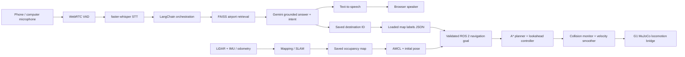

# Browser voice and autonomous airport guidance

The default RAG tab implements the project diagram using continuous browser
microphone input. It separates speech engines from Gemini so the WebRTC VAD,
Whisper, LangChain/FAISS and TTS stages remain explicit.

## Integration

- `g1-navigation-ui/scripts/pipeline_rag.py`: continuous PCM segmentation,
  WebRTC VAD, Whisper, RAG, TTS and navigation handoff. Starts once per voice
  session; pauses produce automatic turns. Microphone capture is gated while a
  full reply is synthesized/played and for a 0.6-second echo tail. Ending the
  session cancels pending navigation preparation and active guidance.
- `g1_conversation/agent/rag_agent.py::invoke_guidance`: FAISS retrieval and one
  Gemini call produce an answer, `none/navigate/cancel` action and saved label ID.
  Coordinates and movement completion are not generated by the LLM.
- `g1-navigation-ui/scripts/console_server.py`: selected map labels and live
  navigation status; prepares A* navigation while retaining RAG; validates map identity,
  localization, free map cell, emergency stop and active collision controls.
  Publishes a `PoseStamped` to `/ui/goal`, which the existing web gateway sends
  to the standalone A* navigator's `NavigateToPose` action. Orientation comes from the saved label yaw.
- Existing `web_gateway.py` reports goal acceptance, progress and result through
  `/ui/navigation_status`, displayed inside the RAG tab. A submitted goal is
  not described as arrival. `/g1/speech_text` and `/g1/agent_response` carry the
  conversation text on ROS.
- Simulation remains a separate process. Spoken requests launch only the A* navigation
  and safety processes needed for guidance after a saved map is localized.
  Planning uses 0.25 m inflation, eight-connected A* and forward lookahead
  tracking with heading alignment. Full-body grid checks and direction-aware
  Collision Monitor preserve physical clearance. A bounded 30 cm backup after
  three seconds without progress replans and retries the same goal.

Use **Maps & Localization** to load/import a map, set the initial pose with an
arrow, and save named labels. Then start the RAG conversation and explicitly
request guidance to one of those names. “Take me to the office” and “Navigate
me to the office” start an escort. “Where is the office?”, “Show me the office”
and “How do I get to the office?” offer an escort without starting movement.
“Take me there” accepts a prior offer; “Okay”, “yes” and “thanks” never issue goals.
General facts and opening-hours questions remain informational. RapidFuzz handles
spelling and common location synonyms; Gemini answers retrieved airport questions.
Ambiguous names require clarification, and numbered destinations must match
the requested gate/terminal/floor number. FAISS remains the airport knowledge
retriever; it does not supply robot coordinates.
Unknown places require clarification instead of guessed map coordinates.
Ending the conversation or changing tabs cancels spoken guidance.

## Validation limits

Offline tests verify speech turn segmentation, silence handling, PCM resampling,
structured intent, rejection of invented IDs, saved pose construction, navigation
startup/readiness checks, interruption and session cancellation. Browser checks
verify continuous worklet capture, playback and microphone cleanup. These checks
use fake STT/LLM/TTS and ROS publishers where needed; they do not prove live model
accuracy, speech recognition quality or physical-robot navigation. An API key,
saved map, labels, initial localization and a running simulator are required for
the complete live voice-to-motion demonstration.

The optional `G1_CONVERSATION_MODE=gemini_live` relay bypasses local STT/TTS and
is a separate experimental mode, not the default architecture shown here.

For stateful guide dialogue, gestures, narrated escorts, playback ordering and
acceptance checks, see [Conversational airport guide](concierge_guide.md).
